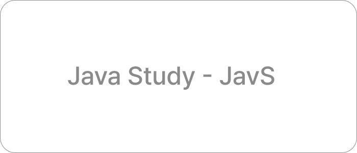

# 2023 Java Study(Javs)

  

## 🗓 Plans

2023.02.17(금) ~ (매주 금요일 19:00)
| 책 |                  진행 기간                  | 모임 일정 |
| :------: | :---------------------------------------------: | :------:|
|  [모던 자바 인 액션](./ModernJavaInAction/README.md)  |   23.02.17 - 23.05.18   | 매 주 금요일 19:00 |
|    [이팩티브 자바](./EffectiveJava/README.md)    |     23.05.18 -      | 매 주 목요일 21:00 |

## 🤝 Study Purpose

> 선택한 책의 빠른 1회독.

> 책을 읽으며 어떤 상황에 어떻게 사용할 것인지의 기준 정립.

> 책을 읽고 주도적으로 더 알아본 부분을 서로 공유하며, 지식의 선순환을 도모.

## 📌 Issue

질문은 5~15분 정도 토론할 수 있는 것으로 준비한다.

가급적 서술형으로 답변할 수 있는 주제를 선정한다.

이미 먼저 등록된 이슈들과 서로 겹치지 않는 문제를 선정하여 이슈로 등록한다.

토론 목적의 문제 이외에도 자유롭게 책의 주제와 관련된 문제들을 등록할 수 있다.

세부 형식은 다음의 내용을 따른다.

이슈 제목 형식 : `문제 제목(이름)`

이슈 라벨 : ex) `이펙티브 자바`, `item52`

이슈 내용 형식
1. 문제가 무엇인가?
2. 왜 이러한 문제를 선정하였는가
3. 자신이 생각하는 답변은 무엇인가

## 🚀 Goals

`모던 자바 인 액션` 빠른 1회독을 목표로 한다.

## 🙋🏻‍♂️ Participants

| 스터디원 |                  Github 프로필                  |
| :------: | :---------------------------------------------: |
|  영규  |   [pyg410](https://github.com/pyg410)   |
|    지민    |     [jminkkk](https://github.com/jminkkk)     |
|   수민   |      [kssumin](https://github.com/kssumin)      |
| 도연 | [capDoYeonLee](https://github.com/capDoYeonLee) |
| 서현 | [blackbean99](https://github.com/blackbean99) | 
| 종민 | [rlajm1203](https://github.com/rlajm1203) |
